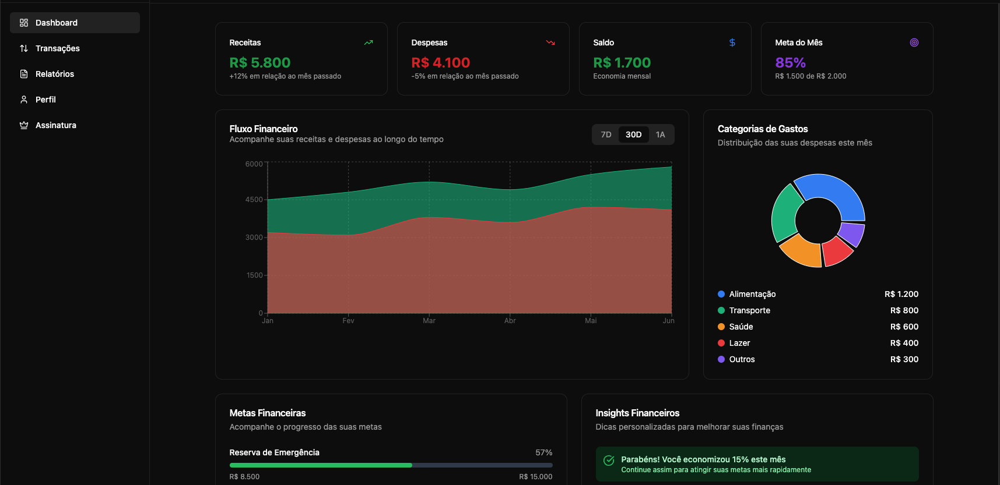
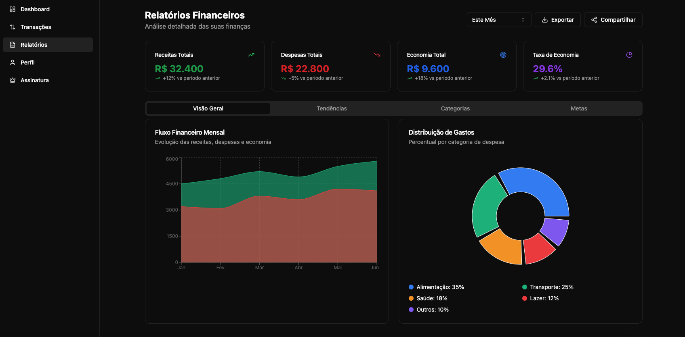
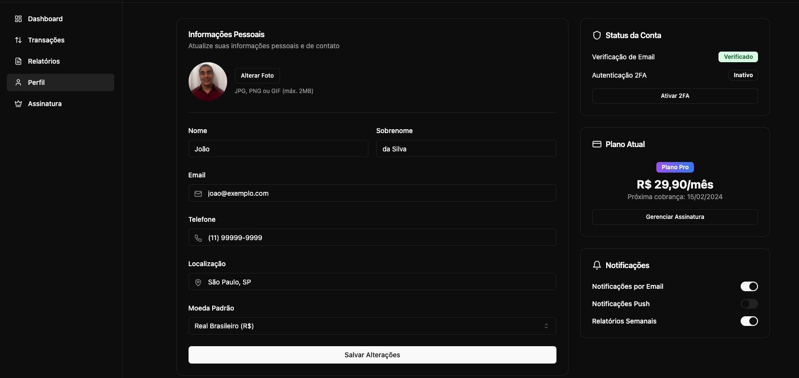

# Finance IA

This project is a web application for personal finance management, that allows users to create an account, login and see their financial reports. The application is built using Next.js, a popular React framework, and uses a PostgreSQL database to store user data.

## Stack

The stack used in this project is:

### Frontend

- React: A best library for frontend
- TypeORM: A TypeScript ORM that allows you to interact with the database using a simple and intuitive API.
- Lucide: A set of React components that provide a simple and intuitive way to create UI components.
- Tailwind CSS: A popular CSS framework that allows you to write more concise and maintainable code.

### Backend

- Golang: A use golang how this backend.
- Gorm: A popular ORM for Golang that provides a simple and intuitive way to interact with the database.
- PostgreSQL: A powerful, open source object-relational database system.

## How to run

To run this project, you need to have Node.js installed on your machine. Then, you can run the following commands:

To run the project, execute the following commands:

- In the `web` folder:

  ```bash
  npm install
  npm run dev
  ```

- In the `server` folder:
  ```bash
  docker-compose up -d postgres
  go run main.go
  ```

## Dashboard Preview

Below is a preview of the application's dashboard:

### Dashboard



### Reports



### Profile


